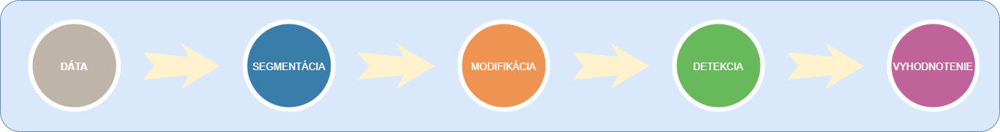

# DP20
Zdrojový kód k diplomovej práci "Modifikácia vstupných vzorov zosnímaných v neriadených podmienkach".

Zverejnenie postupu práce mojej implementácie. Implementácia je rozdelená do viacerých fáz. Návrh riešenia:

## 1. Segmentácia
- [x] Predspracovania vstupného dataset-u. Využitie sietí v tvare "U".
- [x] Predspracovanie vybranej vzorky HF.

## 2. Modifikácia
- [x] Výber dataset-u.
- [x] Trénovanie siete.
- [x] Transformácia HF.

## 3. Detekcia tváre
- [x] Výber detektora.
- [x] Anotácia GT.
- [x] Zisk detekcii.

## 4. Vizualizácia
- [x] Výber metriky.
- [x] Vykresliť výstupy.

@Martin Gajdoš
